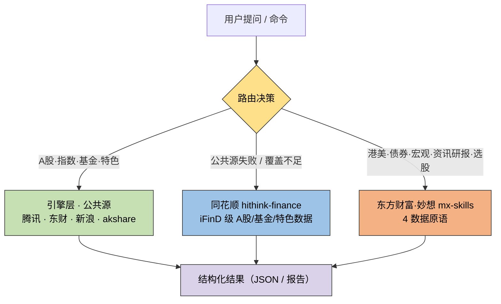

<div align="center">


# A股/美股量化分析工具箱 · AU Stock Data Quant

**20+ 技术指标 · 7 种回测策略 · 多源自动降级 · 港股/期货/期权/宏观 · 东方财富妙想 AI · 同花顺 iFinD · 广发 MCP · F10 财务 · 研报/公告/互动易**

<br>

[](https://python.org)
[](https://github.com/notzhan/au-stock-data-quant)
[](https://opensource.org/licenses/MIT-0)
[](https://github.com/notzhan/au-stock-data-quant)

<br>

[](https://skillhub.cn/skills/astockdataquant)
[](https://clawhub.ai/plugins/a-stock-data-quant)
[](https://claude.ai/settings/plugins/submit)
[](https://github.com/notzhan/au-stock-data-quant/stargazers)

<br>

基于 [akshare](https://github.com/akfamily/akshare) + [MyTT](https://github.com/mpquant/MyTT) + [Ashare](https://github.com/mpquant/Ashare) 构建

本仓库基于 [原项目](https://github.com/jangviktor-web/a-stock-data-quant) 扩展美股 LongPort 行情与 Bark 盘中监控。

数据源: LongPort · akshare · 百度财经 · 通达信 · 东财数据中心 · 同花顺 · 腾讯 · 华尔街见闻 · 巨潮资讯 · 广发MCP

</div>

---

### 一句话介绍

把 A股/美股/港股行情、技术指标、量化回测、盘中监控、AI 金融分析、筹码分布、板块资金流、F10 财务、研报公告，打包成一个可被 AI Agent 直接调用的技能——**自然语言提问即可，无需记命令**。

**直接提问词**：`茅台现在什么价？` / `分析 300750 技术面` / `今天大盘怎么样` / `沪深300ETF该不该买` / `宁德时代资金流`

> [!WARNING]
> **免责声明**：本工具仅供学习研究，**不构成任何投资建议**。技术分析基于历史数据，不预测未来；据此操作风险自负。

---

## 📑 目录

- [🚀 快速安装](#-快速安装)
- [📊 功能矩阵](#-功能矩阵)
- [💡 使用示例](#-使用示例)
- [🎓 新手零基础快速上手](#-新手零基础快速上手)
- [⚡ 快速开始](#-快速开始)
- [📋 命令一览](#-命令一览)
- [📖 详细使用指南](#-详细使用指南)
- [🏗️ 多数据源架构](#️-多数据源架构)
- [⚙️ 配置管理](#️-配置管理)
- [📐 技术指标 & 形态识别](#-技术指标--形态识别)
- [📁 项目结构](#-项目结构)
- [🔄 数据流](#-数据流)
- [📝 更新日志](#-更新日志)
- [🔗 相关项目](#-相关项目)
- [🙏 致谢](#-致谢)
- [⭐ Star History](#-star-history)
- [⚠️ 免责声明](#️-免责声明)

---

## 🚀 快速安装

<details open>
<summary><b>原项目 SkillHub</b></summary>

以下安装入口由原项目发布。使用本 fork 的美股和盘中监控功能，请按下方“直接克隆”安装。

```bash
# 请根据 https://skillhub.cn/install/skillhub.md，安装 @user_ff4d9420/astockdataquant
```

</details>

<details>
<summary><b>原项目 ClawHub</b></summary>

```bash
# 请根据下方命令安装 skill
openclaw skills install @jangviktor-web/a-stock-data-quant
```

</details>

<details>
<summary><b>直接克隆（命令行使用）</b></summary>

```bash
git clone https://github.com/notzhan/au-stock-data-quant.git
cd au-stock-data-quant
pip install -r requirements.txt
```

</details>

---

## 📊 功能矩阵

| 能力 | 覆盖范围 | 说明 |
|:---|:---:|:---|
| 行情数据 | ✅ | A股/港股实时+历史K线，腾讯→东财→mootdx 三级自动降级 |
| 美股量化 | ✅ | LongPort 只读行情；K线、指标、形态、策略回测、综合分析与多股对比 |
| 美股盘中监控 | ✅ | 多股 5 分钟 K 买卖指标、Bark 等通知、systemd 定时器与去重 |
| 技术指标 | ✅ | MA/MACD/RSI/KDJ/BOLL/CCI/ATR/OBV 等 20+ 指标 |
| 形态识别 | ✅ | W底 / 杯柄 / 三重底 / V型反转 / 回踩 / Zigzag |
| 策略回测 | ✅ | 7 种策略（buy_hold/ma_cross/macd/rsi/boll/kdj/ensemble）+ HTML 图表 |
| 筹码分布 | ✅ | 换手率衰减+高斯核，平均成本/获利比例/集中度 |
| 板块资金流 | ✅ | 行业/概念板块主力净流入排名 |
| F10 财务 | ✅ | 营收/净利/ROE/毛利率/资产负债率多期趋势 |
| 资讯研报 | ✅ | 华尔街见闻 11 频道 + 东财研报 + 巨潮互动易 |
| 多市场 | ✅ | 港股 / 期货 / 期权 / 宏观（CN 数据层） |
| AI 金融分析 | ✅ | 东方财富妙想（诊断/选股/问答/资讯/基金） |
| 同花顺 iFinD | ✅ | hithink-finance 备用源（A股/基金/特色，CLI/MCP/REST/SDK） |
| 广发 MCP | ✅ | ETF 排行 / 龙虎榜 / 指数估值 / 财务对比 |
| 市场温度 | ✅ | 5 维度加权 0-100 温度计 + 估值分位 |

---

## 💡 使用示例

### 美股行情与量化分析

美股使用 LongPort OpenAPI，支持 `AAPL` 或 `AAPL.US` 格式。先安装依赖，再配置 `LONGPORT_APP_KEY`、`LONGPORT_APP_SECRET`、`LONGPORT_ACCESS_TOKEN`。复制仓库根目录的 `.env.example` 为 `.env`，填入自己的凭证；`.env` 已被 Git 忽略。还需开通相应美股行情权限。取得凭证后可运行下方命令。

```bash
cp .env.example .env
chmod 600 .env
# 编辑 .env，填入 LongPort 凭证和需要的通知渠道
```

```bash
pip install -r requirements.txt
python bin/quant.py realtime AAPL.US,MSFT.US
python bin/quant.py data AAPL.US --period 1d --count 120
python bin/quant.py indicators AAPL.US --count 120
python bin/quant.py analyze AAPL.US --count 500
python bin/quant.py backtest AAPL.US --strategy ma_cross --count 500
python bin/quant.py compare AAPL.US,MSFT.US
python bin/quant.py data AAPL.US --end 2025-12-31 --count 30
```

美股 K 线按美东交易时区呈现，默认取常规交易时段并使用前复权；单次最多 1000 条。回测按美元与 1 股交易单位计算，手续费和滑点仍为模型假设。A 股专属的资金流、F10、筹码、公告等命令不适用于美股。

### 美股盘中买卖信号监控服务

完整步骤见 [美股盘中监控部署与配置](docs/monitor-deployment.md)。

`bin/monitor.py` 可监控一只或多只美股，默认 `intraday`：美东常规交易时段内，每分钟扫描已完成的 5 分钟 K 线。EMA9 上穿 EMA21 且收盘价高于当日 VWAP 时发买入提醒；EMA9 下穿 EMA21 且收盘价低于当日 VWAP 时发卖出指标提醒。首次可能在美东 09:35 后触发，16:00 起不再发盘中提醒；跳过尚未完成、超过 3 分钟的旧 K 线和盘前/盘后数据。每只股票、每根信号 K 线只通知一次。`MONITOR_SIDES=buy,sell` 可选择提醒方向。`--strategy ensemble` 等旧策略仍可用于收盘后的日线提醒。

这套盘中规则是可配置的技术提醒，尚未验证长期收益，不能据此推断能实现 5% 的 T。

```bash
# 先查看当前盘中信号：不发送通知，也不写入已通知状态
.venv/bin/python bin/monitor.py --symbols MU.US,MRVL.US,SKHY.US,DRAM.US --dry-run

# 如需旧版收盘日线信号，可显式指定策略
.venv/bin/python bin/monitor.py --symbols MU.US,MRVL.US --strategy ensemble --dry-run
```

持续通知时，在项目根目录的 `.env` 中保留 LongPort 三项凭证，并加上监控配置及**一种**通知渠道。文件应仅对自己可读，例如 `chmod 600 .env`。

```dotenv
MONITOR_SYMBOLS=MU.US,MRVL.US,SKHY.US,DRAM.US
MONITOR_STRATEGY=intraday
MONITOR_SIDES=buy,sell
MONITOR_CHANNEL=bark
BARK_URL=https://api.day.app/你的设备密钥
```

其他渠道：钉钉用 `MONITOR_CHANNEL=dingtalk` + `DINGTALK_WEBHOOK_QUANT`；Telegram 用 `MONITOR_CHANNEL=telegram` + `TELEGRAM_BOT_TOKEN`、`TELEGRAM_CHAT_ID`；邮件用 `MONITOR_CHANNEL=email` + `SMTP_HOST`、`SMTP_USER`、`SMTP_PASSWORD`、`ALERT_EMAIL_TO`，可选 `SMTP_PORT`（默认 465）和 `ALERT_EMAIL_FROM`。钉钉若设置了关键字，需允许通知标题中的“买入信号”。

Bark 用 `MONITOR_CHANNEL=bark` + `BARK_URL=https://api.day.app/你的设备密钥`。可用 `bin/monitor.py --test-notification` 发送一条明确标记为测试的消息；Bark 的 [官方文档](https://github.com/Finb/Bark/blob/master/docs/en-us/tutorial.md) 支持将设备密钥放入 JSON 请求体。设备地址只放在 Git 忽略的 `.env` 中。

```bash
.venv/bin/python bin/monitor.py --check-config  # 只核对配置，不联网或发送
bash deploy/install-user-service.sh             # 安装并启动用户级 systemd 定时器
systemctl --user status stock-monitor.timer
journalctl --user -u stock-monitor.service -n 30
```

定时器在上一轮结束约 1 分钟后运行下一轮；非交易时段会跳过盘中信号。修改 `.env` 后下一轮自动读取；修改服务模板后重新运行安装脚本。停止监控：`systemctl --user disable --now stock-monitor.timer`。如需用户登出后继续运行，主机须允许该用户的 systemd linger。通知是技术信号，不是自动下单，也不代表达到特定盈利目标。

当前默认监控名单可在 `.env` 的 `MONITOR_SYMBOLS` 中修改。盘中策略至少需要 30 根常规时段 5 分钟 K；旧日线策略至少需要 40 根日 K。

### 作为 Codex Skill 使用

本仓库的 `.agents/skills/a-stock-data-quant` 指向根目录的 `SKILL.md`，在此仓库启动 Codex 后可输入 `$a-stock-data-quant` 显式调用，也可以直接用自然语言提问，例如“用 a-stock-data-quant 分析 AAPL.US 最近一年的趋势和回测”。如果技能列表尚未显示，重新打开 Codex 会话。美股行情读取项目根目录 `.env` 中的 LongPort 凭证；A 股专属数据仍只用于 A 股。

**查行情**

> **Q**：茅台现在什么价？
> **A**：`python bin/quant.py realtime sh600519` → 最新价 / 涨跌幅 / 成交量 / 成交额（腾讯→东财→mootdx 自动降级）。

**技术分析**

> **Q**：帮我分析一下 300750 的技术面
> **A**：`python bin/quant.py analyze sz300750` → 指标 + 形态 + 策略信号 + 回测，一次出完整报告。

**资金流**

> **Q**：宁德时代最近资金流如何？
> **A**：`python bin/quant.py fund sz300750` 看主力流向，或 `board-flow` 看板块主力净流入。

**AI 诊断**

> **Q**：沪深300ETF 该不该买？
> **A**：`python bin/quant.py em-diagnose sh510300` → 基本面+技术面+资金面+估值综合诊断（内置默认 Key，开箱即用）。

---

## 🎓 新手零基础快速上手

**这个工具是干什么的？** 一句话：帮你查 **A股 / 港股行情**、看**技术指标**、做**量化回测**，还能给出**买卖分析**。不用会写代码，装好就能用。

### 方式一：直接「问」它（零代码，最推荐新手）

如果你通过 SkillHub / ClawHub 把本工具装成了 AI 技能，直接用自然语言提问即可，工具会自动识别并调用：

- 「茅台现在什么价？」
- 「帮我分析一下 300750 的技术面」
- 「沪深300ETF 该不该买？」
- 「今天大盘怎么样？涨停了多少家？」
- 「宁德时代最近资金流如何？」

完全不需要记命令。

### 方式二：命令行（一条命令查行情）

打开终端（Windows 用 PowerShell 或 CMD），按顺序三步：

**第 1 步：装 Python**
前往 [python.org](https://www.python.org/downloads/) 下载 **Python 3.10–3.12（64 位）**，安装时勾选「**Add Python to PATH**」。

**第 2 步：下载并安装依赖**
```bash
git clone https://github.com/notzhan/au-stock-data-quant.git
cd au-stock-data-quant
pip install -r requirements.txt
```

**第 3 步：跑你的第一条命令**
```bash
python bin/quant.py realtime 600519
```
就会看到**贵州茅台**的实时行情（价格 / 涨跌 / 成交量 / 成交额）。

### 新手最常见的 5 个命令

| 想做什么 | 命令 |
|---|---|
| 查一只股票的实时行情 | `python bin/quant.py realtime 600519` |
| 综合分析（指标 + 形态 + 策略信号） | `python bin/quant.py analyze 600519` |
| 看 K 线数据 | `python bin/quant.py data 600519 --count 30` |
| 策略回测（某策略历史赚不赚钱） | `python bin/quant.py backtest 600519` |
| 查港股 / 期货 / 宏观数据 | `python bin/cn/equity.py quote 00700` |

### 常见疑问（FAQ）

- **股票代码怎么写？** A股：沪市 `sh600519`、深市 `sz000858`，也可以直接写 `600519`（自动识别市场）。港股：5 位数字，如 `00700`。
- **看不懂输出？** 先看三个数：**最新价、涨跌幅（%）、成交量**。`analyze` 输出的 MACD/RSI/KDJ 直接看结论行（金叉/死叉、超买/超卖）。
- **提示缺依赖？** 确认已执行 `pip install -r requirements.txt`。
- **报网络错误？** 工具会自动切换备用数据源（腾讯 → 东财 → 新浪…），偶尔数据源不稳定，重试一次即可。
- **想批量看多只股票？** 逗号分隔：`python bin/quant.py realtime 600519,000858`。

### 小词典

| 词 | 意思 |
|---|---|
| 行情 | 股票当前价格与涨跌 |
| K 线 | 每根代表一天的开盘 / 收盘 / 最高 / 最低价 |
| 技术指标 | 由价格计算出的参考值（MACD / RSI / KDJ…） |
| 回测 | 用历史数据验证某个策略是否赚钱 |
| 北向资金 | 外资通过港股通买入 A 股的资金 |
| PE / PB | 判断股价贵不贵的估值指标 |

---

## ⚡ 快速开始

### 安装

```bash
# 本 fork（含美股行情和盘中监控）直接克隆：
git clone https://github.com/notzhan/au-stock-data-quant.git
cd au-stock-data-quant
pip install -r requirements.txt
```

SkillHub/ClawHub 入口由[原项目](https://github.com/jangviktor-web/a-stock-data-quant)发布，版本可能与此 fork 不同。

### 常用命令

```bash
# 综合分析（推荐入口）
python bin/quant.py analyze sh600519

# 多股对比
python bin/quant.py compare sh600519,sz000858,sh601212

# 实时行情
python bin/quant.py realtime sh600519,sz000858

# 筹码分布
python bin/quant.py chip 600519

# 板块资金流
python bin/quant.py board-flow --type concept

# F10财务指标
python bin/quant.py finance 600519

# 华尔街见闻快讯
python bin/quant.py wscn --channel a-stock-channel

# 市场温度计
python bin/quant.py market-temp

# AI 诊断
python bin/quant.py em-diagnose sh600519

# ETF涨幅榜
python bin/quant.py etf-rank --type gainers --top 5

# 龙虎榜排行
python bin/quant.py lhb-gf --mode rank --months m1

# 指数估值分位
python bin/quant.py index-val --top 10

# 广发财务对比
python bin/quant.py gf-quant 600519,000858

# 查看所有命令
python bin/quant.py list
```

### 多市场数据层 (bin/cn)

```bash
# 港股行情 (纯标准库，无 akshare 依赖)
python bin/cn/equity.py quote 00700                     # 腾讯控股
python bin/cn/equity.py history 00700 --days 30         # 港股K线

# CN 期货主连
python bin/cn/futures.py quote cu,au                    # 沪铜/沪金主连
python bin/cn/futures.py list                           # 全部 18 个别名

# CN 期权 (需 akshare)
python bin/cn/options.py underlyings                    # ETF + CFFEX 指数期权标的
python bin/cn/options.py chain 510050 --expiry 202609   # 50ETF 合约链

# CN 宏观 (需 akshare)
python bin/cn/macro.py cpi / lpr / shibor / treasury-yield

# A股公告事件 (需 akshare)
python bin/cn/research.py forecast                       # 业绩预告
python bin/cn/research.py unlock --month 202608          # 限售解禁日历
python bin/cn/research.py dividend --code 600519         # 分红送转
python bin/cn/research.py etf-list / cb-list             # ETF/可转债列表
```

> 价量 / 期货 / 北向等命令为纯标准库实现，无需安装 akshare；研报 / 期权 / 宏观命令需 akshare（`pip install -r requirements.txt` 已包含）。

> Windows 环境用 `python` 代替 `python3`，需要 `PYTHONIOENCODING=utf-8`

---

## 📋 命令一览

<details open>
<summary><b>核心分析 (8个命令)</b></summary>

| 命令 | 功能 | 说明 |
|------|------|------|
| `analyze` | 综合分析 | 行情+指标+形态+策略信号+回测，一次出完整报告 |
| `compare` | 多股对比 | 并排对比多只股票技术面，内置实时行情和综合评分 |
| `backtest` | 策略回测 | 7种策略回测，支持止损/资金量/HTML图表输出 |
| `scan` | 市场扫描 | 全市场板块扫描，按策略信号排序 |
| `indicators` | 技术指标 | MA/MACD/RSI/KDJ/BOLL/CCI/ATR/OBV 等 20+ 指标 |
| `pattern` | 形态识别 | W底、V型反转、杯柄、三重底、回踩买入、Zigzag |
| `fund` | 资金面 | 主力资金流向、融资融券、大中小单分析 |
| `diagnose` | 综合诊断 | 技术面+资金面+形态多维度评分 |

</details>

<details>
<summary><b>数据查询 (10个命令)</b></summary>

| 命令 | 功能 | 说明 |
|------|------|------|
| `realtime` | 实时行情 | 腾讯/东方财富/mootdx 秒级行情，三级降级 |
| `search` | 股票搜索 | 关键词搜索股票代码 |
| `data` | 原始行情 | K线数据，支持多周期 (1m~1M) |
| `market` | 市场情绪面 | 涨停池/跌停池/龙虎榜/北向资金/融资融券 |
| `market-temp` | 市场温度计 | 5维度加权温度分数(0-100)，判断贪婪/恐惧 |
| `valuation` | 估值分位 | PE/PB/PS历史百分位，判断低估/合理/偏高 |
| `info` | 个股深度 | 限售解禁/股东人数/十大股东/行业PE/大宗交易 |
| `macro` | 宏观数据 | CPI/PPI/GDP/PMI/M2/LPR/进出口 |
| `hotspot` | 市场热点 | 人气榜+概念板块+行业板块涨跌 |
| `news` | 新闻资讯 | 东财7x24快讯+财联社电报+东财搜索 |

</details>

<details>
<summary><b>筹码/资金/财务/资讯 (7个命令)</b></summary>

| 命令 | 功能 | 说明 |
|------|------|------|
| `chip` | 筹码分布 | 换手率衰减+高斯核算法，输出平均成本/获利比例/集中度 |
| `board-flow` | 板块资金流 | 行业/概念板块主力净流入排名 |
| `finance` | F10财务指标 | 营收/净利润/ROE/毛利率/资产负债率，多期趋势 |
| `wscn` | 华尔街见闻 | 11频道全球财经快讯 |
| `report` | 个股研报 | 东财reportapi，标题/机构/评级/作者 |
| `notice` | 上市公司公告 | 东财np-anotice-stock，标题/日期/类型 |
| `interactive` | 互动易数据 | 巨潮资讯投资者问答 |

</details>

<details>
<summary><b>PanWatch 数据 (5个命令)</b></summary>

| 命令 | 功能 | 说明 |
|------|------|------|
| `hot-stocks` | 热门股票排行 | 按成交额/涨幅/换手率排序 |
| `hot-boards` | 热门板块排行 | 行业/概念板块涨跌排名 |
| `board-stocks` | 板块成分股 | 指定板块的成分股列表 |
| `capital-flow` | 资金流向细分 | 主力/超大单/大单/中单/小单净流入 |
| `fundamentals` | 基本面快照 | PE/PB/总市值/流通市值 |

</details>

<details>
<summary><b>广发MCP数据 (4个命令)</b></summary>

| 命令 | 说明 | 示例 |
|------|------|------|
| `etf-rank` | ETF排行榜 (13种) | `etf-rank --type gainers` |
| `lhb-gf` | 龙虎榜深度分析 | `lhb-gf --mode rank --months m3` |
| `index-val` | 指数估值分位 | `index-val --top 10` |
| `gf-quant` | 广发财务对比 | `gf-quant 600519,000858` |

</details>

<details>
<summary><b>AI 能力 — 东方财富妙想 (5个命令)</b></summary>

| 命令 | 功能 | 说明 |
|------|------|------|
| `em-diagnose` | AI 诊断 | 基本面+技术面+资金面+估值综合分析 |
| `em-pick` | AI 选股 | 自然语言条件选股 |
| `em-ask` | AI 问答 | 任意金融问题 |
| `em-news` | AI 资讯 | 实时财经新闻搜索 |
| `em-fund` | AI 基金 | 基金诊断+持仓分析 |

</details>

---

## 📖 详细使用指南

<details open>
<summary><b>analyze — 综合分析</b></summary>

一次出完整报告：行情概览 + 技术指标 + 形态识别 + 策略信号 + 策略回测。

```bash
python bin/quant.py analyze sh600519                        # 默认日线
python bin/quant.py analyze sh600519 --period 1w --count 500  # 周线500根
python bin/quant.py analyze sh510500 --capital 200000 --stop-loss 0.05
python bin/quant.py analyze sh600519 --html                  # 生成HTML图表
```

**解读速查**：

| 看到 | 意味着 | 建议 |
|------|--------|------|
| MA5偏离>2% | 短期涨太快 | 注意回调 |
| MACD金叉 | 中期动能向上 | 偏多 |
| RSI>70 | 超买 | 不宜追高 |
| ensemble跑赢buy_hold | 策略有超额收益 | 可参考信号 |
| 最大回撤>15% | 波动大 | 需设止损 |

</details>

<details>
<summary><b>compare — 多股对比</b></summary>

```bash
python bin/quant.py compare sh600519,sz000858,sh601212
python bin/quant.py compare sh000001,sz399001,sz399006 --period 1w
```

输出各股指标并排对比 + 综合评分排名 + 实时价格。评分最高 = 技术面最强。

</details>

<details>
<summary><b>backtest — 策略回测</b></summary>

```bash
python bin/quant.py backtest sh510500 --strategy ensemble    # 多策略共振（推荐）
python bin/quant.py backtest sh600519 --strategy macd --html # 含HTML图表
python bin/quant.py backtest sh600519 --strategy rsi --capital 200000 --stop-loss 0.05
```

| 策略 | 逻辑 | 适用场景 |
|------|------|---------|
| `buy_hold` | 买入持有（基准） | 对比基准 |
| `ma_cross` | MA5/MA20金叉死叉 | 趋势行情 |
| `macd` | DIF/DEA交叉 | 中期趋势 |
| `rsi` | RSI超买超卖 | 震荡行情 |
| `boll` | 布林带轨道反弹 | 区间震荡 |
| `kdj` | KDJ金叉死叉 | 短线交易 |
| `ensemble` | **多策略共振（推荐）** | 过滤假信号 |

**关键指标**：总收益率 vs 基准、最大回撤<15%较健康、夏普>1较好>2优秀、胜率>50%正期望。

</details>

<details>
<summary><b>chip — 筹码分布分析</b></summary>

基于K线+换手率近似计算筹码分布（移植自 go-stock），输出平均成本/获利比例/集中度。

```bash
python bin/quant.py chip 600519                # 默认日线120根
python bin/quant.py chip sh600519 --count 250  # 250根K线
python bin/quant.py chip sh600519 --bins 100   # 100个价格分箱
```

```
============================================================
  筹码分布分析 (120个交易日)
============================================================
  当前价格: 1308.00
  平均成本: 1358.63
  获利比例: 31.7%
  价格区间: 1151.01 ~ 1568.00
  筹码集中度(前5): 17.2%
------------------------------------------------------------
  筹码最集中价位:
       1409.02    4.5%  ████
       1403.81    4.4%  ████
       1414.23    3.4%  ███
============================================================
  解读: 筹码分布相对均衡
```

**解读速查**：

| 看到 | 意味着 | 建议 |
|------|--------|------|
| 获利比例>80% | 大部分筹码盈利 | 抛压大，注意回调 |
| 获利比例<20% | 大部分筹码套牢 | 可能接近底部区域 |
| 平均成本≈当前价 | 市场成本一致 | 变盘窗口，关注方向 |
| 集中度(前5)>40% | 筹码高度集中 | 主力控盘，波动可能加大 |

</details>

<details>
<summary><b>board-flow — 板块资金流</b></summary>

行业/概念板块主力净流入排名（东财 data.eastmoney.com）。

```bash
python bin/quant.py board-flow                     # 行业板块(默认)
python bin/quant.py board-flow --type concept      # 概念板块
python bin/quant.py board-flow --top 10            # 前10名
```

```
======================================================================
  行业板块资金流排名 (主力净流入)
======================================================================
  排名 板块名称     代码       主力净流入
----------------------------------------------------------------------
  1    半导体     BK1036     🟢+166.18亿
  2    通信设备   BK0448     🟢+47.04亿
  3    白酒       BK0477     🔴-12.45亿
======================================================================
  统计: 15个流入 / 5个流出
```

**解读速查**：

| 看到 | 意味着 | 建议 |
|------|--------|------|
| 行业板块连续3日净流入 | 资金持续看好 | 关注行业内龙头 |
| 概念板块单日暴增 | 短线热点炒作 | 追高风险大 |
| 流入/流出比>3:1 | 市场资金面偏多 | 可适度参与 |

</details>

<details>
<summary><b>finance — F10财务指标</b></summary>

东财 datacenter 历史财务数据（营收/净利润/ROE/毛利率/资产负债率）。

```bash
python bin/quant.py finance 600519                # 最近5期
python bin/quant.py finance 600519 --periods 8    # 最近8期
python bin/quant.py finance 600519 --forecast     # 含机构预测
```

```
================================================================================
  F10 主要财务指标: 600519
================================================================================
  📅 2026-03-31
    每股收益: 21.76 元
    每股净资产: 216.32 元
    ROE(加权): 10.57% | 毛利率: 89.76%
    资产负债率: 12.12%
    营收同比: 6.34% | 净利同比: 1.47%
================================================================================
```

**解读速查**：

| 看到 | 意味着 | 建议 |
|------|--------|------|
| ROE连续3期>15% | 盈利能力强且稳定 | 优质公司特征 |
| 毛利率同比下降>5% | 成本压力或竞争加剧 | 关注后续趋势 |
| 营收同比+但净利同比- | 增收不增利 | 警惕费用失控 |
| 资产负债率>70% | 高杠杆 | 注意偿债风险 |

</details>

<details>
<summary><b>wscn — 华尔街见闻快讯</b></summary>

多频道全球财经快讯。

```bash
python bin/quant.py wscn                              # 全球7x24(默认)
python bin/quant.py wscn --channel a-stock-channel    # A股频道
python bin/quant.py wscn --channel us-stock-channel   # 美股频道
python bin/quant.py wscn --limit 10                   # 10条
```

频道列表：`global-channel` | `a-stock-channel` | `us-stock-channel` | `hk-stock-channel` | `forex-channel` | `commodity-channel` | `goldc-channel` | `oil-channel` | `bond-channel` | `crypto-channel` | `xgb-channel`

</details>

<details>
<summary><b>report / notice / interactive — 研报·公告·互动易</b></summary>

```bash
python bin/quant.py report 600519              # 个股研报
python bin/quant.py report 600519 --days 90    # 最近90天

python bin/quant.py notice 600519              # 上市公司公告
python bin/quant.py notice 600519 --top 10     # 前10条

python bin/quant.py interactive 茅台            # 互动易搜索
python bin/quant.py interactive 600519         # 按股票代码搜索
```

</details>

<details>
<summary><b>market — 市场情绪面</b></summary>

涨停池/跌停池/情绪判断/龙虎榜/板块资金流/北向资金/融资融券。

```bash
python bin/quant.py market                      # 默认参数
python bin/quant.py market --limit 10 --days 5  # 显示10条，龙虎榜近5日
```

**情绪周期速查**：

| 状态 | 涨停数 | 跌停数 | 操作建议 |
|------|--------|--------|---------|
| 冰点期 | <30 | >50 | 最好的埋伏时机 |
| 修复期 | 增多 | 减少 | 小仓位试探 |
| 高潮期 | >100 | <10 | 最危险，准备撤退 |
| 退潮期 | 减少 | 增多 | 绝不追高 |

</details>

<details>
<summary><b>market-temp / valuation — 温度·估值</b></summary>

```bash
python bin/quant.py market-temp              # 市场温度 (0-100)
python bin/quant.py market-temp --json       # JSON输出

python bin/quant.py valuation 600519         # 茅台估值分位
python bin/quant.py valuation 000858 --json  # JSON输出
```

**温度解读**：≥70 偏热/贪婪 | 40-70 中性 | <40 偏冷/恐惧

**分位解读**：<30% 低估 | 30-70% 合理 | >70% 偏高

</details>

<details>
<summary><b>PanWatch 数据集成</b></summary>

移植自 PanWatch 的轻量数据接口，不依赖 akshare。

```bash
python bin/quant.py hot-stocks --mode turnover        # 热门股票(成交额)
python bin/quant.py hot-stocks --mode gainers -n 10   # 热门股票(涨幅前10)
python bin/quant.py hot-boards --mode gainers         # 热门板块(涨幅)
python bin/quant.py board-stocks BK0892 -n 10         # 白酒板块成分股
python bin/quant.py capital-flow 600519               # 资金流向细分
python bin/quant.py fundamentals 600519               # 基本面快照
```

</details>

<details>
<summary><b>东方财富妙想 AI</b></summary>

随包内置 base64 混淆的 `EM_API_KEY` 默认值（开箱即用），亦可在 `config.yaml` 设置 `em_api_key` 覆盖，或注册自有 Key：https://ai-saas.eastmoney.com/mxClaw

```bash
python bin/quant.py em-diagnose sh600519                  # AI综合诊断
python bin/quant.py em-pick "白酒板块龙头"                 # AI自然语言选股
python bin/quant.py em-ask "茅台Q1业绩怎么样"              # AI问答
python bin/quant.py em-news 白酒                           # AI资讯
python bin/quant.py em-fund sh600519                      # AI基金分析
```

</details>

<details>
<summary><b>广发MCP数据 — etf-rank / lhb-gf / index-val / gf-quant</b></summary>

```bash
# ETF排行榜 (13种榜单)
python bin/quant.py etf-rank --type gainers --top 10
python bin/quant.py etf-rank --type losers
python bin/quant.py etf-rank --type volume

# 龙虎榜深度分析
python bin/quant.py lhb-gf --mode rank --months m1 --top 10
python bin/quant.py lhb-gf --mode date --date 20260728

# 指数估值分位
python bin/quant.py index-val --top 20

# 广发财务对比
python bin/quant.py gf-quant 600519,000858,000568
```

**ETF解读**：涨幅前3 + 换手率>10% → 短期资金博弈 | 规模榜前10 → 主流配置方向

**指数估值**：PE分位<20% → 历史低估 | >80% → 历史高估 | 低估+ETF资金流入 → 左侧布局信号

**龙虎榜**：上榜>10次/月 → 高度活跃 | 买入额>>卖出额 → 资金净流入

**财务对比**：PE低于行业均值 + 百分位<30% → 相对低估 | PB百分位<20% → 历史底部区域

</details>

---

## 🏗️ 多数据源架构



### 多数据源自动降级

```
akshare 失败 → 百度财经 / 通达信 / 东财数据中心 / 同花顺
实时行情: 腾讯 → 东方财富 → mootdx (三级降级)
K线数据:  新浪 → 腾讯 → mootdx → 百度 (四级降级)
```

降级过程对用户透明，stderr 输出 `[降级]` 提示，不影响正常输出。

### 广发MCP数据矩阵

- **ETF排行榜**: 13种榜单 (涨幅/跌幅/规模/换手率/资金流等)
- **龙虎榜深度**: 上榜排行/指定日期查询/营业部统计/日历视图
- **指数估值分位**: PE/PB百分位 + 低估/合理/高估评估 + 关联ETF
- **财务对比**: 市值/PE/PB/行业均值/历史百分位

### 同花顺金融数据服务（hithink-finance）集成

- **iFinD 级权威源**：经 `HiThink-Tech/Financial-API` 融合，提供 A股行情/复权K线、财报三表、估值快照、集合竞价、指数/板块、公募基金(28端点)、特色数据(涨停跌停/异动/热榜/龙虎榜,11端点) 与全市场 Parquet 导出。
- **四种接入**：CLI / MCP(4端点·55工具) / REST(59端点) / Python SDK，统一 Key `HITHINK_FINANCE_API_KEY`（fuyao.aicubes.cn 获取）。
- **互补不替代**：配置 Key 时优先走 hithink（数据更全、含权威复权因子）；未配置回退引擎层。详见 `references/hithink-finance/`。

### 东方财富·妙想（mx-skills）集成（v3.8.0 新增）

- **备用源·与 hithink 互补**：hithink 补 A股/指数/基金/特色，妙想补 hithink 不覆盖的 **港股 / 美股 / 债券 / 全球宏观 / 资讯·公告·券商研报 / 智能选股**。
- **4 个数据原语**：`mx-finance-data`（全市场自然语言查数）、`mx-finance-search`（资讯/研报检索）、`mx-macro-data`（全球宏观查数）、`mx-stocks-screener`（智能选股），并入 `references/mx-skills/`。
- **统一授权 `EM_API_KEY`**：随包内置 base64 混淆的默认 Key（开箱即用，用户无需知晓）；用户亦可在妙想平台注册自有 Key 后通过 `EM_API_KEY` 环境变量或 `~/.mx-skills/em_api_key` 覆盖。获取/授权地址 `https://ai-saas.eastmoney.com/mxClaw`。
- **公共源优先**：仅当公共源不可用/覆盖不足且用户同意时才启用。详见 SKILL.md「东方财富·妙想（mx-skills）集成」章节。

<details>
<summary><b>降级链总览</b></summary>

| 数据类型 | 主数据源 | 备用源 |
|----------|----------|--------|
| 实时行情 | 腾讯 → 东方财富 | mootdx (通达信TCP 7709) |
| 历史K线 | 新浪 → 腾讯 | mootdx → 百度财经 |
| 资金流向 | akshare | 百度分钟级资金流 |
| 龙虎榜 | akshare | 东财数据中心 |
| 融资融券 | akshare | 东财数据中心 |
| 限售解禁 | akshare | 东财数据中心 |
| 股东人数 | akshare | 东财数据中心 |
| 大宗交易 | akshare | 东财数据中心 |
| 北向资金 | akshare | 同花顺 |
| 概念板块 | akshare | 百度财经 |
| 新闻资讯 | 东财7x24 + 财联社 | 华尔街见闻 |
| 板块资金流 | 东财 data.eastmoney.com | akshare |
| F10财务 | 东财 datacenter | — |
| 估值分位 | 东财 datacenter | 百度估值 |
| 研报 | 东财 reportapi | — |
| 公告 | 东财 np-anotice-stock | — |
| 互动易 | 巨潮 irm.cninfo | — |
| 华尔街见闻 | api-one-wscn.awtmt.com | — |
| 广发MCP | ETF/龙虎榜/指数估值/财务 | MCP JSON-RPC |

</details>

<details>
<summary><b>降级机制</b></summary>

使用 `@_with_fallback` 装饰器包装 akshare 函数：

```python
@_with_fallback(_ak_fund_flow, ('百度', _baidu_fund_flow))
def get_fund_flow(code, market=None):
    ...
```

- 主数据源成功 → 直接返回
- 主数据源失败 → 自动尝试备用源
- 全部失败 → 返回空结果，stderr 输出错误信息
- 降级提示输出到 stderr，不污染 stdout JSON 输出

</details>

---

## ⚙️ 配置管理

**凭证与监控参数**放在 Git 忽略的 `.env` 中，从 [.env.example](.env.example) 复制。LongPort 使用 `LONGPORT_APP_KEY`、`LONGPORT_APP_SECRET`、`LONGPORT_ACCESS_TOKEN`；盘中监控使用 `MONITOR_SYMBOLS`、`MONITOR_STRATEGY=intraday`、`MONITOR_SIDES=buy,sell`。Bark 通知使用 `MONITOR_CHANNEL=bark` 和 `BARK_URL`。完整步骤见 [部署与配置文档](docs/monitor-deployment.md)。

东方财富、同花顺、广发的自有凭证可分别通过 `EM_API_KEY`、`HITHINK_FINANCE_API_KEY`、`GF_SKILLS_APIKEY` 环境变量提供。仓库跟踪的 `config.yaml` 用于回测资金、手续费、数据缓存等普通参数；请勿向其中写入自己的明文密钥。

```bash
python bin/quant.py cache stats         # 查看缓存统计
python bin/quant.py cache clear         # 清理过期缓存
python bin/quant.py cache clear --older-than 7  # 清理7天前的缓存
```

---

## 📐 技术指标 & 形态识别

<details>
<summary><b>20+ 技术指标</b></summary>

```
MA    简单移动平均      EMA   指数移动平均
MACD  指数平滑异同      RSI   相对强弱指标
BOLL  布林带           KDJ   随机指标
CCI   商品通道指数      WR    威廉指标
ATR   真实波动幅度      BIAS  乖离率
OBV   能量潮           DMI   动向指标
TRIX  三重指数平滑      VR    成交量比率
EMV   简易波动指标      BBI   多空指标
MFI   资金流量指标      ASI   累积摆动指标
PSY   心理线           SAR   抛物线指标
```

</details>

<details>
<summary><b>形态识别</b></summary>

| 形态 | 参数 | 信号 |
|------|------|------|
| W底 | `w-bottom` | 底部反转 |
| V型反转 | `v-reversal` | 底部反转 |
| 杯柄 | `cup-handle` | 突破买入 |
| 三重底 | `triple-bottom` | 底部确认 |
| 回踩买入 | `dip-buy` | 顺势买入 |
| Zigzag | `zigzag` | 趋势转折点 |

"已确认"比"形成中"更可靠。深度越大，后续反弹空间通常越大。

</details>

<details>
<summary><b>参数速查</b></summary>

| 参数 | 说明 | 默认值 |
|------|------|--------|
| `--period` | K线周期 | `1d` |
| `--count` | 数据条数 | `120` |
| `--strategy` | 策略名 | `buy_hold` |
| `--capital` | 初始资金 | `100000` |
| `--stop-loss` | 止损比例(如0.05=5%) | 无 |
| `--ensemble N` | 共振阈值 | `3` |
| `--html` | 生成HTML图表 | — |
| `--json` | 输出JSON格式 | — |
| `--source` | 数据源(tencent/eastmoney/mootdx) | auto |

**K线周期**：`1d` 日线 | `1w` 周线 | `1M` 月线 | `1m` `5m` `15m` `30m` `60m` 分钟线

**股票代码**：沪市 `sh` + 6位 (`sh600519`) | 深市 `sz` + 6位 (`sz000858`)

不知道代码？→ `python bin/quant.py search 茅台`

> `chip` 和 `finance` 命令支持裸代码（如 `600519`），自动补全 sh/sz 前缀。

</details>

---

## 📁 项目结构

```
a-stock-data-quant/
├── bin/
│   ├── quant.py              # CLI 主入口 (2400+ 行)
│   ├── stock_full.py         # 综合分析脚本
│   └── cn/                   # 多市场数据层 CLI（港股/期货/期权/宏观/公告）
│       ├── equity.py         #   A股+港股行情/历史/搜索/北向/涨跌停/板块 (stdlib)
│       ├── futures.py        #   18 个 CN 商品期货主连 (stdlib)
│       ├── research.py       #   A股三表/业绩预告/龙虎榜/解禁/股东/增减持/回购/分红/新股/ETF/可转债 (akshare)
│       ├── options.py        #   ETF 期权 + CFFEX 指数期权 (akshare)
│       └── macro.py          #   CN 宏观深度序列 (akshare)
├── lib/
│   ├── akshare_data.py       # akshare 数据层 + 降级链
│   ├── ashare.py             # 行情数据获取 (含mootdx/百度降级)
│   ├── backtest.py           # 回测引擎
│   ├── board_fund_flow.py    # 板块资金流 (东财data.eastmoney.com)
│   ├── chart.py              # ECharts HTML 图表生成
│   ├── chip_distribution.py  # 筹码分布计算 (移植自 go-stock)
│   ├── data_cache.py         # CSV+JSON 数据缓存 (4档TTL)
│   ├── em_api.py             # 东方财富妙想 AI 接口
│   ├── f10_finance.py        # F10财务指标 (东财datacenter)
│   ├── fallback.py           # 多数据源降级引擎
│   ├── market_temp.py        # 市场温度计 (5指标加权)
│   ├── mytt.py               # 技术指标库 (MyTT V3.4)
│   ├── patterns.py           # 形态识别
│   ├── realtime_data.py      # 实时行情 (腾讯/东方财富/mootdx)
│   ├── settings.py           # 配置管理 (含密钥混淆)
│   ├── sources_baidu.py      # 百度财经 API (K线/资金流/概念)
│   ├── sources_datacenter.py # 东财数据中心 (龙虎榜/融资/大宗/股东/解禁)
│   ├── sources_gf.py         # 广发MCP数据适配层
│   ├── sources_hexin.py      # 同花顺北向资金
│   ├── sources_mootdx.py     # 通达信 TCP 7709 (实时/K线)
│   ├── sources_news.py       # 新闻聚合 (东财7x24/财联社/搜索)
│   ├── sources_panwatch.py   # PanWatch 数据接口 (热门榜/板块/资金/基本面)
│   ├── sources_wallstreetcn.py # 华尔街见闻 (全球快讯/财经日历)
│   ├── stock_notice.py       # 研报/公告/互动易 (东财reportapi/np-anotice/巨潮)
│   ├── strategies.py         # 策略模块
│   └── valuation.py          # 个股估值分位 (东财datacenter+百度)
├── references/
│   ├── multi-market/        # 多市场数据层字段/路由/源文档
│   ├── hithink-finance/     # 同花顺金融数据服务文档
│   ├── mx-skills/           # 东方财富妙想 4 数据原语文档
│   └── research-workflows/   # 研报写作工作流（读年报/可比/深度/快评/纪要/行业/晨会/摘要）
├── CONNECTORS.md             # 连接器占位符与可选增强说明
├── config.yaml.example       # 配置模板 (密钥需自行申请)
├── SKILL.md                  # AI Agent skill 文档
├── requirements.txt          # Python 依赖
└── LICENSE                   # MIT-0
```

---

## 🔄 数据流

<details>
<summary><b>完整数据流图</b></summary>

```
用户输入 → 意图路由 → quant.py CLI
  ├─ analyze/compare/backtest/scan/indicators/pattern/fund/diagnose
  │   → akshare_data.py → mytt.py (指标) → strategies.py (信号)
  │   → [降级] → sources_baidu.py / sources_datacenter.py / sources_hexin.py
  │   → backtest.py (回测) → chart.py (HTML) → output
  ├─ realtime/search
  │   → realtime_data.py (腾讯→东方财富→mootdx) → output
  ├─ news (新闻资讯)
  │   → sources_news.py (东财7x24/财联社/东财搜索) → output
  ├─ market (市场情绪面)
  │   → akshare_data.py (涨停池/跌停池/龙虎榜/北向/融资融券) → output
  ├─ market-temp (市场温度计)
  │   → market_temp.py (巴菲特/股债利差/涨跌停比/QVIX/活跃度) → output
  ├─ hot-stocks / hot-boards / board-stocks
  │   → sources_panwatch.py (东财clist) → output
  ├─ capital-flow (资金流向细分)
  │   → sources_panwatch.py (东财fflow) → output
  ├─ fundamentals (基本面快照)
  │   → sources_panwatch.py (腾讯qt.gtimg) → output
  ├─ valuation (估值分位)
  │   → valuation.py (东财datacenter PE/PB/PS历史 → 分位计算) → output
  ├─ info (个股深度)
  │   → akshare_data.py (限售解禁/股东人数/十大股东/行业PE/大宗交易) → output
  ├─ chip (筹码分布)
  │   → ashare.py (K线) → chip_distribution.py (换手率衰减+高斯核) → output
  ├─ board-flow (板块资金流)
  │   → board_fund_flow.py (东财 data.eastmoney.com/dataapi/bkzj) → output
  ├─ finance (F10财务指标)
  │   → f10_finance.py (东财 datacenter) → output
  ├─ wscn (华尔街见闻)
  │   → sources_wallstreetcn.py (api-one-wscn.awtmt.com) → output
  ├─ report/notice/interactive (研报/公告/互动易)
  │   → stock_notice.py (东财reportapi/np-anotice/巨潮irm.cninfo) → output
  ├─ em-diagnose/em-pick/em-ask/em-news/em-fund
  │   → em_api.py (东方财富妙想AI) → output
  ├─ etf-rank → sources_gf.py → MCP etf_rank → 格式化 → output
  ├─ lhb-gf   → sources_gf.py → MCP lhb → 格式化 → output
  ├─ index-val → sources_gf.py → MCP windmill → 格式化 → output
  ├─ gf-quant  → sources_gf.py → MCP quant → 格式化 → output
  └─ macro/hotspot/cache/list
      → akshare_data.py / settings.py / data_cache.py → output
```

</details>

---

## 📝 更新日志

> [!NOTE]
> **最新版本 v3.8.1 (2026-08-28)**：OpenClaw 格式合规（metadata.openclaw 声明可选环境变量 + MIT-0 协议 + .clawhubignore）。数据能力延续 v3.8.0——同花顺(hithink) 备用源 + 东方财富妙想(mx-skills) 4 数据原语。引擎层 + 同花顺 + 妙想 三层叠加，覆盖全数据类型（行情 / 财务 / 宏观 / 资讯研报 / 选股）。

<details open>
<summary><b>v3.8.1 (2026-08-28) — OpenClaw 格式合规</b></summary>

- **协议**：MIT → **MIT-0**（ClawHub 强制要求）
- **metadata.openclaw**：声明可选环境变量 `EM_API_KEY` / `HITHINK_FINANCE_API_KEY`（均为可选，内置默认 Key 兜底）
- **.clawhubignore**：发布卫生，排除 venv / cache / results.tsv 等

</details>

<details open>
<summary><b>v3.8.0 (2026-08-26) — 同花顺备用源 + 东方财富妙想(mx-skills) 4数据原语</b></summary>

### 新增功能

- **同花顺金融数据服务（hithink-finance）集成**：融合 `HiThink-Tech/Financial-API`，iFinD 级 A股行情/复权K线、财报三表、估值快照、指数/板块、公募基金(28端点)、特色数据(涨停跌停/异动/热榜/龙虎榜,11端点) 与全市场 Parquet 导出；CLI / MCP(4端点·55工具) / REST(59端点) / Python SDK 四种接入；统一 Key `HITHINK_FINANCE_API_KEY`（fuyao.aicubes.cn 获取），配置时优先、未配置回退引擎层。详见 `references/hithink-finance/`。
- **东方财富·妙想（mx-skills）集成**：并入 4 个数据原语——`mx-finance-data`（全市场自然语言查数）、`mx-finance-search`（资讯/研报检索）、`mx-macro-data`（全球宏观查数）、`mx-stocks-screener`（智能选股），补 hithink 不覆盖的 港股/美股/债券/全球宏观/资讯·公告·券商研报/智能选股；作为公共源失败时的备用源，详见 `references/mx-skills/`。
- **内置默认 Key（开箱即用）**：mx-skills 原语随包内置 base64 混淆的 `EM_API_KEY` 默认值（用户无需配置或知晓），亦支持 `EM_API_KEY` 环境变量或 `~/.mx-skills/em_api_key` 覆盖；获取/授权地址 `https://ai-saas.eastmoney.com/mxClaw`。

### 行为变化

- 路由策略：公共源优先，仅当公共源不可用/覆盖不足且用户同意时才启用 hithink / 妙想备用源。

</details>

<details open>
<summary><b>v3.7.0 (2026-08-21) — 多市场数据层 + 研报工作流 + 决策建议</b></summary>

### 新增功能

- **港股数据**：港股实时行情 / K线（东财 / Sina / 腾讯多源），如 `bin/cn/equity.py quote 00700`
- **CN 期货**：18 个境内商品期货主连行情（SHFE / DCE / CZCE / INE / GFEX），如 `bin/cn/futures.py quote cu,au`
- **CN 期权**：ETF 期权（50 / 300 / 500 / 科创50ETF）+ CFFEX 指数期权（IO / MO / HO），支持到期月、合约链、PCR 与 IV 汇总，如 `bin/cn/options.py chain 510050 --expiry 202609`
- **CN 宏观数据**：CPI / PPI / GDP / M0M1M2 / PMI（制造业 / 非制造业 / 财新）/ 社融 / LPR / SHIBOR / 国债收益率 / 工业增加值 / 零售 / 固定资产投资 / 存款准备金率 / 财政，如 `bin/cn/macro.py cpi`
- **A股公告事件**：业绩预告 / 快报 / 披露计划、龙虎榜（当日 / 个股历史）、大宗交易、限售解禁日历、股东户数、高管增减持、回购实施、分红送转、IPO 日历与中签，如 `bin/cn/research.py unlock --month 202608`
- **ETF / 可转债**：无需 key 的列表与实时行情，如 `bin/cn/research.py etf-list` / `cb-quote 113050`
- **研报写作工作流**：读年报（结构化投资备忘录）、可比公司分析（估值倍数矩阵 + 隐含股价）、深度报告、业绩快评、调研纪要、行业研究、晨会纪要、研报摘要（观点分歧矩阵），详见 `references/research-workflows/`
- **买卖决策工作流**：个股与 ETF 的多指标综合决策——技术 / 估值 / 资金 / 基本面四维诊断 → 买入 / 增持 / 持有 / 减仓 / 卖出 + 置信度 + 核心矛盾点 + 条件化操作框架 + 强制免责声明

### 修复

- **腾讯实时行情**：成交额字段单位错位（万元被当元使用）修正，并补齐成交量 / 成交额返回
- **腾讯日K**：http 被 302 重定向 → 改用 https 端点
- **同花顺北向**：适配响应结构变更，避免解析崩溃并给出降级信号
- **百度K线**：显式识别 403 废弃状态，给出"改用腾讯 / 新浪"的替代提示
- **裸 6 位代码**：自动补齐市场前缀（`5` 开头识别为上交所 ETF，如 510300 / 518880）
- **东方财富实时源**：空响应防护 + 自动降级，不再中断整条取数链路

### 优化

- **北向资金**：数据源切换至更稳定的通道，作为原通道的替代
- **多源自动降级链**：任一源崩溃不中断，逐级回退到下一可用源
- **惰性依赖**：研报 / 期权 / 宏观脚本对 akshare 采用惰性导入，缺失时仅相关命令提示安装，价量等标准库路径不受影响

### 行为变化

- Python 依赖：akshare 版本要求提升至 `>=1.18.64`
- 新增独立数据层 CLI：`bin/cn/{equity,futures,research,options,macro}.py`（价量 / 期货 / 北向等为纯标准库实现）
- 新增 `CONNECTORS.md`：连接器占位符与可选增强说明

</details>

<details open>
<summary><b>v3.6.0 (2026-07-28) — 广发MCP数据矩阵</b></summary>

- 新增: 广发MCP数据矩阵 (etf-rank/lhb-gf/index-val/gf-quant)
- 新增: ETF排行榜13种榜单 (涨幅/跌幅/规模/换手率/资金流等)
- 新增: 龙虎榜深度分析 (上榜排行/指定日期/营业部统计)
- 新增: 指数估值分位 (PE/PB百分位 + 关联ETF)
- 新增: 广发财务对比 (市值/估值/行业均值/历史百分位)
- 修复: hot-stocks 格式化崩溃 (price为float时ValueError)
- 修复: _gf_check() config读取函数名错误
- 修复: index-val NoneType格式化 (pePercent/pbPercent为null)

</details>

<details>
<summary><b>v3.5.0 (2026-07-21) — go-stock P0+P1 集成</b></summary>

新增功能：
- **筹码分布** (`chip`): 基于换手率衰减+高斯核分配算法（移植自 [go-stock](https://github.com/ArvinLovegood/go-stock)）
- **板块资金流** (`board-flow`): 行业/概念板块主力净流入排名
- **F10财务指标** (`finance`): 营收/净利润/ROE/毛利率/资产负债率/EPS
- **华尔街见闻快讯** (`wscn`): 11频道全球财经快讯
- **个股研报** (`report`): 东财 reportapi 研报列表
- **上市公司公告** (`notice`): 东财 np-anotice-stock 公告列表
- **互动易数据** (`interactive`): 巨潮资讯投资者问答搜索

</details>

<details>
<summary><b>v3.4.0 (2026-07-15) — PanWatch 数据集成</b></summary>

- **热门股票排行** (`hot-stocks`): 按成交额/涨幅/换手率排序
- **热门板块排行** (`hot-boards`): 行业/概念板块涨跌排名
- **板块成分股** (`board-stocks`): 指定板块的成分股列表
- **资金流向细分** (`capital-flow`): 主力/超大单/大单/中单/小单净流入
- **基本面快照** (`fundamentals`): PE/PB/总市值/流通市值

</details>

<details>
<summary><b>v3.3.0 (2026-07-10) — 市场温度计 + 估值分位</b></summary>

- **市场温度计** (`market-temp`): 综合5维度计算0-100温度分数
- **个股估值分位** (`valuation`): PE/PB/PS历史百分位

</details>

<details>
<summary><b>v3.2.0 (2026-05-19) — 多数据源备份 + 新闻资讯</b></summary>

- **多数据源自动降级**: 主数据源失效时自动切换备用源
- **新闻资讯** (`news`): 东财7x24 + 财联社 + 东财搜索
- **市场情绪面** (`market`): 涨停池/跌停池/龙虎榜/北向资金/融资融券
- **个股深度** (`info`): 限售解禁/股东人数/十大股东/行业PE/大宗交易

</details>

<details>
<summary><b>v3.1.0 (2026-05-15) — 东方财富妙想 AI + 实时行情</b></summary>

- **东方财富妙想 AI**: 5个AI命令 (em-diagnose/em-pick/em-ask/em-news/em-fund)
- **实时行情** (`realtime`): 腾讯/东方财富秒级行情
- **股票搜索** (`search`): 关键词搜索股票代码
- **HTML 图表**: ECharts 交互式图表
- **数据缓存**: CSV 缓存 + TTL 过期

</details>

<details>
<summary><b>v3.0.0 / v2.0.0 / v1.0.0</b></summary>

- **v3.0.0** (2026-05-15): 综合诊断 (`diagnose`) + 宏观数据 (`macro`) + 市场热点 (`hotspot`)
- **v2.0.0** (2026-05-13): 综合分析 (`analyze`) + 多股对比 (`compare`) + 策略回测 (`backtest`) + 形态识别 (`pattern`)
- **v1.0.0** (2026-05-12): 基于 akshare + MyTT + Ashare 构建，支持 20+ 技术指标

</details>

---

## 🔗 相关项目

<div align="center">

### [策盈QuantWin · 股票K线分析 App](https://github.com/jangviktor-web/finance_chart)

同一作者的 Flutter 跨平台股票 K 线 App，与本项目共享同一套行情/指标数据栈。Android 优先，覆盖代码质量、架构、性能与安全的持续优化。

| 共享能力 | 说明 |
|:---:|:---|
| 行情 + 技术指标 | 复用 akshare / MyTT 同源数据逻辑 |
| K 线图表 | 交互式蜡烛图 + 多指标叠加 |
| 多周期 | 日/周/月/分钟线 |

</div>

---

## 🙏 致谢

<div align="center">

| 项目 | 说明 |
| :---: | :---: |
| [akshare](https://github.com/akfamily/akshare) | A股数据 |
| [MyTT](https://github.com/mpquant/MyTT) | 技术指标库 |
| [Ashare](https://github.com/mpquant/Ashare) | 行情数据接口 |
| [mootdx](https://github.com/mootdx/mootdx) | 通达信行情接口 |
| [东方财富妙想](https://ai-oss.eastmoney.com) | AI金融分析接口 |
| [go-stock](https://github.com/ArvinLovegood/go-stock) | 筹码分布算法参考 |
| [PanWatch](https://github.com/TNT-Likely/PanWatch) | 热门榜/板块/资金数据 |
| [华尔街见闻](https://wallstreetcn.com) | 全球财经快讯 |
| [巨潮资讯](https://www.cninfo.com.cn) | 互动易投资者问答 |
| [广发证券MCP](https://mcp.gf.com.cn) | ETF/龙虎榜/指数估值 |
| [stock-api](https://github.com/zhangxiangliang/stock-api) | 实时行情协议参考 |
| [a-stock-data](https://github.com/simonlin1212/a-stock-data) | 备用数据源 API 参考 |

</div>

---

## ⭐ Star History

[](https://repostars.dev/?repos=jangviktor-web%2Fa-stock-data-quant&theme=grape)

---

## ⚠️ 免责声明

> [!WARNING]
> 本工具所有数据来自公开第三方接口，仅供学习与研究使用，**不构成任何投资建议或证券交易邀请**。市场有风险，投资需谨慎；任何依据本工具输出做出的交易决策，风险与后果由使用者自行承担。

---

<div align="center">

**License**: MIT-0

**Stars**: 如果这个项目对你有帮助，请给一个 ⭐ Star 支持一下！

</div>
